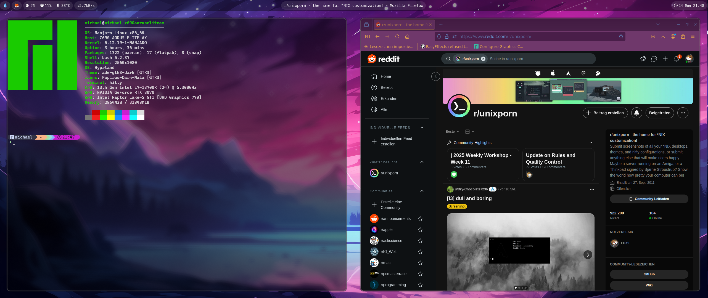
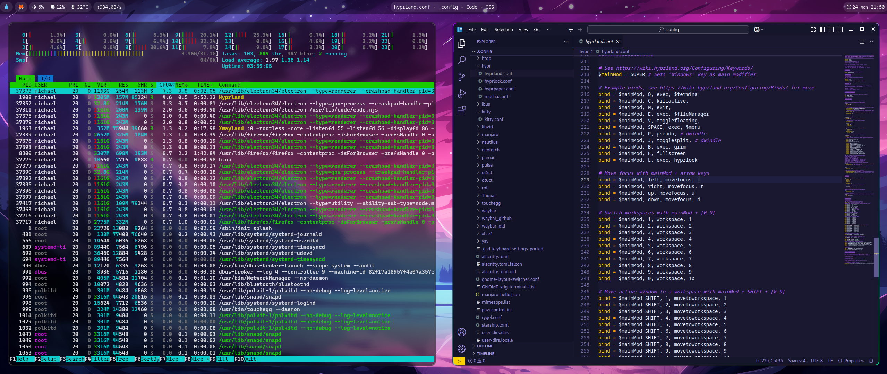
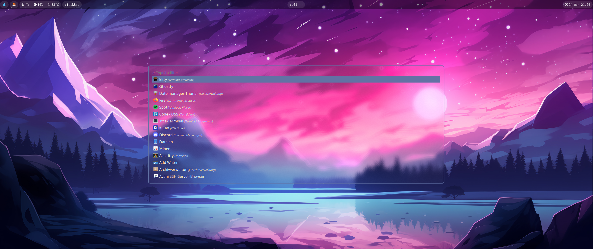

# Rice of Hyprland

A sleek and modern Hyprland rice featuring transparent frosted glass aesthetics.

## Features

- Smooth, transparent, frosted glass windows.
- Minimalistic and clean UI.
- Custom theming for Waybar, Rofi, and Kitty.
- Lightweight and responsive design.

## Dependencies

This rice requires the following programs:

- **Hyprlock** (for screen locking)
- **Hyprpaper** (for wallpaper management)
- **Kitty** (for the terminal emulator)
- **Rofi** (for application launcher)
- **Waybar** (for the status bar)
- **Starship** (for prompt theming)
- **Neofetch** (for system information display)
- **Firefox** (Webbrowser)

See the setup in action:

